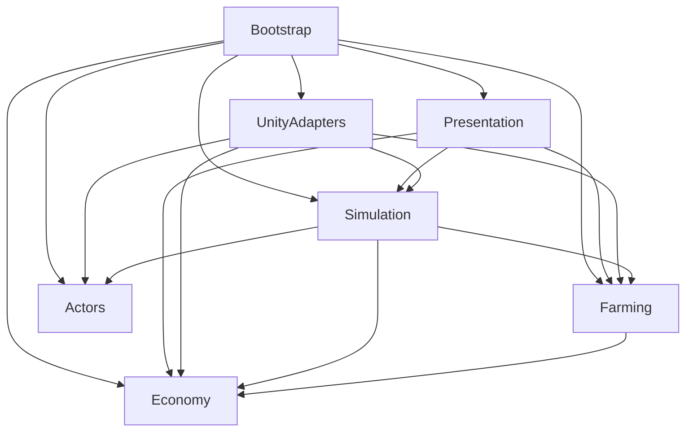

# Thiết kế architecture nông trại: DI, asmdef và design patterns

Ngày: 2026-09-23. Trạng thái: bản thiết kế, chưa triển khai runtime. Quyết định của người dùng: **DI thuần, wire up tại Bootstrap Root; không dùng VContainer**.

Tài liệu đã được tách thành [các chủ đề architecture riêng](../../architecture/README.md) để phân tích và thảo luận. Bản tổng này giữ làm tham chiếu; các phương án chưa được người dùng chốt vẫn là đề xuất.

**Cập nhật hướng composition:** mô tả manual wiring ở tài liệu tổng là phương án cũ. Quy tắc đang thảo luận là [Reflection Factory cho class logic C#](../../architecture/13-reflection-factory.md), với Bootstrap cấp dependency từ Unity/scene. Khi có khác biệt, dùng tài liệu theo chủ đề làm nguồn mới hơn.

## 1. Cơ sở và phạm vi

Thiết kế dựa trên `Requirement.txt`, tài liệu `E:/Unity Projects/unity_architecture_asmdef_infrastructure_vcontainer.md` và cấu trúc project hiện tại. Các đoạn prompt/chỉ dẫn trong tài liệu phân tích được xem là nội dung tham khảo; yêu cầu hiện tại là thiết kế architecture.

Hiện trạng đã kiểm tra:

- Unity **6000.3.16f1**, target Android; Unity 2021.3.x trong requirement là phiên bản của APK demo, chưa phải yêu cầu đổi phiên bản project.
- Đã có AI Navigation **2.0.12**, uGUI, Test Framework; chưa có VContainer trong manifest.
- Chưa tìm thấy file C# hoặc asmdef trong Assets. Có prefab Box, Construction, Delivery, Customer, Market và các UI được mô tả trong requirement.
- Có `demo-interview-4.5.apk`, nhưng chưa chạy để quan sát gameplay. Không khẳng định thiết kế đã khớp hoàn toàn demo.
- Thư mục hiện tại chưa phải Git repository. Tài liệu này không có commit.

Mục tiêu: dependency rõ bằng asmdef; đối tượng được cấp dependency qua DI; gameplay có thể test riêng; các pattern giải quyết bài toán thật của test. Sản phẩm của bước này là thiết kế, không phải code, package installation hay APK.

### Requirement và giả định thiết kế

| Nội dung | Quyết định |
|---|---|
| Click hộp → Build → mở hộp, có cây | Bắt buộc; quản lý theo PlotId ổn định |
| Click cây → Upgrade → tăng cấp và lợi nhuận | Bắt buộc; đường cong giá/cấp bằng data |
| Giá được tính tại thời điểm thu hoạch | Bắt buộc; snapshot bất biến tại lúc hoàn tất thu hoạch |
| Dân mang hàng tới quầy; có khách thì bán và nhận tiền | Bắt buộc; giao dịch một lần trên mỗi lô hàng |
| Ban đầu một khách; nâng cấp thêm khách | Bắt buộc; đề xuất hiểu +2 là tăng số khách hoạt động mục tiêu từ 1 lên 3 |
| Buff riêng một cây / toàn bộ cây | Bắt buộc; áp dụng theo nguồn, không sửa base stat |
| Trạng thái, hành vi, chỉ số nhân vật | Bắt buộc; FSM và stat modifiers |
| Tìm đường, vượt chướng ngại vật | Bắt buộc; NavMesh cho đường đi quanh vật cản; link riêng nếu cần nhảy/bước qua |
| Tiền lớn và lưu trữ | Bắt buộc; số nguyên chính xác, biểu diễn chuỗi khi lưu |
| “Màn hình dọc 1920x1080” | Hai mô tả mâu thuẫn nếu hiểu width × height; đề xuất Portrait với canvas tham chiếu 1080 × 1920 |

Giả định chưa được APK xác nhận: có chi phí build/upgrade; một dân giữ một lô hàng; mỗi lần giao bán hết lô cho một khách; cây có chu kỳ tái thu hoạch; khách đã mua đi ra rồi được thay thế để giữ số lượng mục tiêu. Tất cả là quy tắc đề xuất, cần đối chiếu demo trước khi chốt gameplay. Số dân ban đầu, thời gian, capacity, giá và cost nằm trong config; không tự coi một giá trị cụ thể là requirement.

Lưu local tiến trình là đề xuất để đáp ứng thực dụng việc lưu tiền. Không suy diễn requirement thành cloud save, offline income hoặc phục hồi chính xác mọi nhân vật đang chạy.

## 2. Các phương án và lựa chọn

| Phương án | Ưu điểm | Đánh đổi |
|---|---|---|
| **Manual DI + module theo nghiệp vụ** | Không cần DI framework, wiring và ownership tường minh | Bootstrap quản lý tạo/dispose và lifecycle |
| DI container + module theo nghiệp vụ | Tự động resolve graph, hỗ trợ scope | Không chọn theo yêu cầu người dùng |
| Tách mỗi feature thành Domain/Application/Infrastructure/Presentation | Ranh giới rất chi tiết | Quá nhiều assembly và interface cho bài test này |

**Chọn phương án 1 theo yêu cầu người dùng:** constructor injection cho C# service, explicit initialization cho MonoBehaviour, dùng `new` và factory tại composition root. Một Bootstrap Root cho scene nông trại; chưa cần root xuyên nhiều scene. Không DI container, resolver, registration framework hoặc custom service registry.

## 3. Cấu trúc và các assembly

```text
Assets/Game/
├── Economy/                 Farm.Economy.asmdef
├── Farming/                 Farm.Farming.asmdef
├── Actors/                  Farm.Actors.asmdef
├── Simulation/              Farm.Simulation.asmdef
│   ├── Construction/
│   ├── Logistics/
│   ├── Market/
│   ├── Progression/
│   └── Persistence/
├── UnityAdapters/           Farm.UnityAdapters.asmdef
│   ├── Navigation/
│   ├── World/
│   ├── Configuration/
│   └── Persistence/
├── Presentation/            Farm.Presentation.asmdef
├── Bootstrap/               Farm.Bootstrap.asmdef
└── Tests/
    ├── EditMode/            Farm.Tests.EditMode.asmdef
    └── PlayMode/            Farm.Tests.PlayMode.asmdef
```

Đây là cây thư mục dự kiến, chưa được scaffold. Giữ nguyên vị trí tài nguyên hiện có; script mới có thể gắn lên prefab đó. Không di chuyển asset chỉ để khớp layout.

### Ownership và reference trực tiếp

Trong bảng và sơ đồ, `A → B` nghĩa là **assembly A reference assembly B**, không phải hướng dữ liệu runtime.

| Assembly | Trách nhiệm / API chính | Project references trực tiếp |
|---|---|---|
| `Farm.Economy` | `CurrencyId`, `Money` (currency + số lượng), `Wallet` nhiều loại tiền | Không |
| `Farm.Farming` | `Plot`, `Crop`, `HarvestBatch`, `CropService`, `ProfitCalculator`, modifier lợi nhuận | Economy: giá và giá trị lô hàng |
| `Farm.Actors` | `ActorStats`, modifier nhân vật, `IActorState`, FSM nhỏ, `IMovementAgent`, `IActorAnimation` | Không |
| `Farm.Simulation` | Build/Upgrade use case, task assignment, worker/customer states cụ thể, quầy/hàng đợi, thanh toán, progression, save DTO và ports | Economy: ví; Farming: cây/lô; Actors: điều khiển nhân vật |
| `Farm.UnityAdapters` | NavMesh adapter, Animator adapter, world components, SO → config runtime, JSON save adapter | Actors: implement motor/animation; Simulation: save/config/world contracts; Farming và Economy: ánh xạ dữ liệu |
| `Farm.Presentation` | View, presenter, click selection, HUD, cửa sổ xây dựng/nâng cấp, phản ứng VFX | Simulation: gọi use case; Farming: đọc cây; Economy: hiển thị tiền |
| `Farm.Bootstrap` | `GameBootstrap`, tạo object graph, tick bridge, concrete spawn factories, nối scene references và presenters | Cả sáu assembly ở trên: composition |



Package references: UnityAdapters reference AI Navigation khi dùng component của package; Presentation reference UI/TMP tương ứng component sử dụng. Bootstrap không reference DI package. Dùng đúng tên assembly trong package đã cài khi triển khai, không suy ra tên asmdef từ package ID.

Không có `Farming → Simulation`, `Actors → Simulation`, `Simulation → UI` hay `Simulation → UnityAdapters`. State nghiệp vụ của dân/khách nằm trong Simulation để Actors không phải biết cây hoặc chợ.

### Quy tắc asmdef

- Economy, Farming, Simulation: `noEngineReferences = true`; không UnityEngine, MonoBehaviour, ScriptableObject hoặc VContainer.
- Actors cho phép UnityEngine để port di chuyển dùng trực tiếp `Vector3`; FSM/stat vẫn là lớp C# thường, không dùng scene lookup. Không tạo wrapper vector chỉ để loại bỏ Unity.
- UnityAdapters, Presentation, Bootstrap cho phép engine references.
- `autoReferenced = false` trên assembly game để tránh predefined assemblies tự tham chiếu vào; reference giữa các asmdef vẫn khai báo tường minh. Tùy chọn này không tự chặn mọi DLL/package bên ngoài.
- Kiểm soát precompiled plugin DLL riêng nếu có; không sửa vendor asmdef để áp quy tắc của game.
- Không để gameplay mới trong Assembly-CSharp. Dùng GUID reference sau khi asset asmdef tồn tại, giữ `.meta` trong Git.
- Implementation nội bộ dùng `internal` khi không cần truy cập ngoài. Concrete class cần Bootstrap khởi tạo phải public, hoặc được tạo qua public factory của module; không đánh dấu internal rồi yêu cầu Bootstrap gọi constructor trực tiếp.
- Test asmdef dùng cấu hình test assembly phù hợp và reference module cần test; runtime không reference tests. EditMode chỉ Editor, PlayMode theo thiết lập Unity Test Framework.

Unity mô tả riêng reference giữa asmdef, predefined assemblies và precompiled assemblies trong [tài liệu assembly references](https://docs.unity3d.com/6000.0/Documentation/Manual/assembly-definitions-referencing.html).

`UnityAdapters` hiện là một assembly nhỏ với vài tích hợp Unity/local I/O. Khi thêm SDK độc lập như cloud save hay analytics, tách adapter đó thành assembly riêng; không biến nó thành chỗ chứa mọi SDK.

## 4. DI và composition root

`GameBootstrap : MonoBehaviour` trong Bootstrap là composition root của scene nông trại. Nó có serialized references tới config, world bindings, prefab catalog và UI bindings. Trong startup, nó tạo service bằng constructor, nối adapter/factory/presenter rồi mới bật simulation. Không có `GetService<T>()`, resolver hay registry type-to-object.

| Đối tượng | Lifetime đề xuất | Người sở hữu / cleanup |
|---|---|---|
| Wallet, CropService, MarketService, ProgressionService, simulation runner | Một instance mỗi scene session | Bootstrap giữ references; cleanup khi scene kết thúc |
| Config runtime bất biến | Một instance đã validate cho scene | Bootstrap chuyển từ SO rồi truyền qua constructor |
| Save adapter, coordinator | Một instance mỗi scene session | Bootstrap hoàn tất save trước teardown; dispose tài nguyên I/O nếu có |
| Presenter | Một instance mỗi view đang được bind | Bootstrap sở hữu; Unsubscribe view/model khi dispose |
| Actor controller, FSM, motor và view | Một bộ mới mỗi lần spawn | Actor handle/factory theo dõi, dispose khi despawn |
| Giá trị Money, lô hàng, modifier | Tạo bằng constructor thông thường | Model sở hữu |

Lifetime là quy tắc ownership của dự án, không phải container scope. Bootstrap gọi `Dispose()` tường minh cho đối tượng sở hữu tài nguyên/subscription, theo thứ tự ngược với khởi tạo. Object thuần dữ liệu không cần triển khai IDisposable cho hình thức. Các GameObject được spawn nằm dưới runtime root của scene; factory chịu trách nhiệm dispose controller và hủy view khi despawn.

Flow composition:

1. Đọc/validate config và scene references; load tiến trình nếu có.
2. Tạo domain services, adapter và factory; cấp dependency qua constructor.
3. Bind các MonoBehaviour bằng `Initialize(...)` tường minh, không dùng injection attribute trong view.
4. Khôi phục cây/nâng cấp/tiền, tạo dân và số khách mục tiêu.
5. Khi graph đã sẵn sàng, bật cờ initialized. `GameBootstrap.Update()` chuyển `deltaTime` vào runner; không chạy tick khi initialization chưa thành công.
6. Teardown: dừng tick/spawn → hoàn tất save theo policy → dispose presenter → despawn/dispose actor → dispose coordinator/adapter cần cleanup → giải phóng scene references. Cleanup có guard để gọi lặp vẫn an toàn; startup lỗi giữa chừng phải dọn các object đã tạo.

Factory tạo actor bằng runtime parameters như ActorId, vị trí và config. Mỗi actor có FSM và state mutable riêng. Các service dùng chung được inject vào factory; factory dùng `Instantiate` cho prefab và `new` cho controller/state để compose actor mới. Gọi `Initialize(...)` trước khi cho actor nhận tick; Awake/OnEnable của view không truy cập dependency chưa được cấp.

Không tìm dependency trong Tick/state/view, không singleton tĩnh hay Service Locator. Không dùng `FindObjectOfType` hoặc static `GameBootstrap.Instance` để lấy service. Nếu sau này nhiều scene, mới thêm AppBootstrap và chọn rõ service nào sống xuyên scene; scene object không được giữ trong service sống lâu hơn scene.

### Object graph khởi tạo tường minh

```text
GameBootstrap
  ├─ tạo config runtime + world bindings + save adapter
  ├─ tạo Wallet và CropService
  ├─ tạo MarketService(wallet) và ProgressionService(wallet, crops, population)
  ├─ tạo navigation gateway / world query adapters
  ├─ tạo WorkerFactory(crops, market, navigation, actor config, prefab)
  ├─ tạo CustomerFactory(market, navigation, actor config, prefab)
  ├─ tạo PopulationController(population, customerFactory)
  ├─ tạo SimulationRunner(services, populationController, actor collection)
  └─ tạo presenters(views, services) → initialize → start
```

Đây là sơ đồ wiring, không phải API code đã triển khai. `population` là model số khách mục tiêu thuộc Simulation. ProgressionService chỉ cập nhật model này, không phụ thuộc factory/controller; PopulationController dùng factory để bù khách. Factory nhận service cần thiết, không nhận toàn bộ Bootstrap. Nhờ vậy graph khởi tạo không có vòng `service → factory → service`.

## 5. Public API và quyền thay đổi dữ liệu

Các tên dưới đây là contract dự kiến của game, chưa phải code đã triển khai.

| Owner | API / contract | Ý nghĩa |
|---|---|---|
| Economy | `Wallet.TrySpend(cost)`, `Wallet.Credit(amount)` | Validate số tiền, không để balance âm; caller không set balance |
| Farming | `CropService.TryReserveHarvest(plotId, workerId)` | Giữ quyền thu hoạch bằng reservation token |
| Farming | `CropService.TryCompleteHarvest(token)` | Validate và tạo một HarvestBatch có snapshot giá |
| Actors | `IMovementAgent` | Ra lệnh di chuyển/dừng, báo Pending/Moving/Arrived/Unreachable; dùng Vector3 |
| Actors | `IActorAnimation` | Yêu cầu animation semantic: đi, thu hoạch, mang hàng |
| Simulation | `ConstructionService.TryBuild(plotId)` | Check điều kiện và chi phí, chuyển plot hợp lệ |
| Simulation | `ProgressionService.TryPurchase(upgradeId, targetId)` | Áp dụng một upgrade đã cấu hình |
| Simulation | `MarketService.TryCompleteSale(batchId, dockToken, customerId)` | Xác nhận giao dịch một lần, cấp tiền đúng snapshot |
| Simulation | `ICustomerSpawner` / `IWorkerSpawner` | Tạo/despawn actor runtime; implementation ở Bootstrap |
| Simulation | `IProgressStore` | Load/Save DTO tiến trình; implementation JSON ở UnityAdapters |
| Simulation | `IWorldQuery` | Truy vấn đích có thể đi và chi phí đường; implementation ở UnityAdapters |

`IWorldQuery` nhận ID cây/điểm/actor, trả kết quả và chi phí; không đẩy Transform/NavMeshPath vào Simulation. Một port `IActorNavigation` thuộc Simulation nhận destination ID và trả trạng thái di chuyển. Adapter ở UnityAdapters ánh xạ destination ID sang Vector3 rồi gọi `IMovementAgent`. State nghiệp vụ chỉ dùng port theo ID; không khai báo kiểu Unity trong Simulation. Actors vẫn dùng Vector3 cho phần cơ chế di chuyển, không tạo custom vector wrapper.

Ưu tiên inject concrete service khi không có nhu cầu thay implementation. Interface chỉ cho boundary/fake có ích: di chuyển, world query, spawn, persistence. Không tạo interface cho mọi class.

UI gửi ý định, service quyết định thành công/thất bại và trả kết quả có lý do: NotEnoughMoney, AlreadyBuilt, MaxLevel, InvalidTarget, Unreachable. Event C# theo service chỉ thông báo sau khi commit; không dùng event bus để thực hiện chuỗi giao dịch.

## 6. Pattern áp dụng

| Pattern | Nơi áp dụng | Giá trị cụ thể | Giới hạn |
|---|---|---|---|
| **State** | Worker FSM, Customer FSM | Mỗi hành vi có enter/tick/exit và cleanup rõ | Không cần state machine framework tổng quát |
| **Factory** | WorkerFactory, CustomerFactory, composition của cây nếu cần | Ghép prefab + config + motor + controller/FSM khi spawn | Không tạo factory cho Money hoặc DTO |
| **Strategy** | Ba hiệu ứng nâng cấp | Chọn thay đổi lợi nhuận một cây, mọi cây, hoặc số khách bằng data | Một registry EffectKind → handler; không reflection scan |
| **Adapter** | NavMesh, Animator, local save | Gameplay gọi port; implementation phụ thuộc engine/I/O | Không wrap mọi Unity type |
| **Observer** | BalanceChanged, CropChanged, UpgradePurchased | HUD, view, VFX phản ứng sau mutation | Subscription có owner; không global event bus |
| **MVP đơn giản** | Build/Upgrade/Management UI | View hiển thị; presenter gọi use case | Không thêm MVVM framework |
| **Value Object** | Money, HarvestBatch snapshot, modifier key | Giữ invariant và tránh sửa nhầm dữ liệu | Không biến mỗi primitive thành một tầng abstraction |
| **Builder: chưa dùng runtime** | Có thể dùng fixture test nhiều tham số sau này | Hữu ích nếu cấu hình actor phức tạp dần | Hiện Factory + config đủ; không thêm fluent builder cho đủ pattern |

### 6.1 Worker State Pattern

```text
Idle → MoveToCrop → Harvesting → MoveToMarket → WaitingForCustomer → Delivering → Idle
```

- Idle nhận một harvest job và reservation. Không có job thì chờ, không tạo path mỗi frame.
- MoveToCrop chỉ hoàn tất khi motor báo Arrived. Unreachable/timeout → release reservation, backoff, chọn lại.
- Harvesting chạy timer logic. Lúc timer hoàn tất, service kiểm tra token/cây, tính giá và tạo lô đúng một lần.
- MoveToMarket giữ nguyên lô. Không đi được thì giữ hàng và retry có giới hạn tần suất; không quay lại thu hoạch thêm và không làm mất hàng.
- WaitingForCustomer cần quyền sử dụng dock và một khách đã tới quầy trước khi Delivering.
- Delivering gọi giao dịch; chỉ xóa hàng khi giao dịch thành công.
- Exit/cancel giải phóng tài nguyên của state; quyền sở hữu lô thuộc worker/session, không thuộc một state tạm thời. Despawn ngoài teardown phải trả lô về pending delivery hoặc bị từ chối cho tới khi xử lý xong.

Mỗi worker sở hữu state riêng. Cùng một simulation tick xử lý có thứ tự; animation event không có quyền cấp hàng/tiền lần thứ hai.

### 6.2 Customer State Pattern

```text
Spawn → MoveToQueue → Waiting → Receiving → Leaving → Despawn
```

Market giữ FIFO và slot reservation. Khách chỉ vào Waiting sau khi tới vị trí. Một khách nhận đúng một sale; sau Leaving mới thay thế theo target population. Upgrade +2 tăng target một lần, spawner bù phần thiếu có giới hạn nhịp spawn. Khi không còn slot đứng, giữ khách ngoài điểm vào hợp lệ hoặc hoãn spawn, không chồng vô hạn tại dock.

### 6.3 Trạng thái cây

`Box → Building → Ready → Reserved/Harvesting → Cooldown → Ready`.

Đây là state dữ liệu nhỏ: enum + transition methods trước, chưa cần một class cho mỗi trạng thái. Chỉ tách thành State objects nếu enter/exit/tick của cây trở nên đủ phức tạp. Level và modifier không bị reset khi đổi trạng thái.

### 6.4 Upgrade Strategy

`UpgradeDefinition` có ID, cost, mức tối đa, effect kind, target scope và magnitude. Ba implementation của `IUpgradeEffect` nằm trong Simulation:

- `SingleCropProfitEffect`: thêm/cập nhật nguồn multiplier cho đúng PlotId.
- `AllCropsProfitEffect`: cập nhật modifier toàn nông trại; cây xây sau cũng được hưởng.
- `CustomerCapacityEffect`: tăng target customer count.

ProgressionService kiểm tra trước toàn bộ điều kiện và số tiền, sau đó commit spend + effect + purchased level trong cùng lệnh đồng bộ, không yield. Handler effect không làm I/O/spawn và không thất bại sau bước validate; spawner phản ứng sau commit. Không hỗ trợ rollback/undo framework cho bài test này.

Strategy chọn cây thu hoạch có thể thêm khi cần nhiều hành vi. Bản đầu dùng một hàm chọn cây sẵn sàng có chi phí đường đi thấp nhất, tie-break bằng PlotId; chưa tạo nhiều strategy không dùng.

## 7. Tiền lớn, giá thu hoạch và buff

### 7.1 Money

Đề xuất `Money` bất biến gồm `CurrencyId` và `System.Numerics.BigInteger Amount`; mỗi currency có đơn vị nguyên nhỏ nhất riêng. `Wallet` giữ số dư theo currency. Số dư/cost không âm; không dùng float/double cho số dư, phép mua hoặc payout. Save/config phải lưu cả currency và amount dạng chuỗi thập phân, parse/validate tại boundary. Việc dùng BigInteger trên Android phải được kiểm tra bằng build IL2CPP thực tế khi triển khai.

Tỷ lệ phần trăm biểu diễn bằng số nguyên/rational, không chuyển tiền lớn về float để nhân. Ví dụ 10% = 1000 basis points trên 10000. UI có thể rút gọn K/M/B nhưng chỉ format từ giá trị gốc; chuỗi rút gọn không được dùng để tính hoặc lưu.

### 7.2 Công thức đề xuất

```text
levelFactor(L) = 1 + 0.10 × (L - 1)
unitPriceExact = basePrice × levelFactor × localMultipliers × globalMultipliers
batchSaleValue = floor(quantity × unitPriceExact)
```

Ví dụ Level 2 +10%, Level 3 +20% được hiểu là so với base, không lũy tiến 1.1 × 1.2. Công thức thực tế lấy từ bảng config để có thể chỉnh theo APK. Nhân tử và mẫu số nguyên được giữ tới cuối phép tính; làm tròn xuống một lần trên tổng lô. Giá UI một đơn vị có thể làm tròn để hiển thị nhưng không dùng lại làm input thanh toán.

Base 100, quantity 3, level 2, buff cây ×2, buff toàn bộ ×2 → snapshot **1320**. Dân đang mang lô này thì upgrade level 3 vẫn bán **1320**; lô tiếp theo cùng quantity bán **1440**.

`HarvestBatch` bất biến gồm BatchId, PlotId, quantity và **SaleValue** đã tính. Có thể giữ level/modifier version lúc harvest để debug; không cần giữ tham chiếu live tới Crop để tính lại tiền khi bán.

### 7.3 Modifier nhiều nguồn

Key: `(SourceId, TargetId, StatId)`; operation: FlatAdd, PercentAdd hoặc Multiply. Cùng key là cập nhật, không cộng chồng ngoài ý muốn. Khác nguồn tuân theo công thức:

```text
effective = clamp((base + Σflat) × (1 + Σpercent) × Πmultiplier)
```

- Stats nhân vật: move speed, harvest rate, carry capacity. Thời gian thu hoạch = base duration / effective harvest rate, tránh buff tốc độ lại làm tăng thời gian.
- Capacity làm tròn xuống, tối thiểu 1; speed/rate có giới hạn dương từ config.
- Modifier lợi nhuận dùng số chính xác, không dùng pipeline float của movement stats.
- Gỡ buff bằng SourceId; không chia ngược vào giá trị đã sửa.
- Chỉ tính lại khi base/modifier thay đổi. Với ít actor không cần cache invalidation framework.
- Actor stat modifier thuộc Actors; profit modifier thuộc Farming. Chưa tạo một generic Stats assembly chung vì yêu cầu số học khác nhau.
- Giá và quantity đã chốt trong lô không đổi khi buff hết hạn hoặc capacity giảm. Move speed có thể cập nhật trực tiếp; duration của một lượt harvest được snapshot khi bắt đầu lượt để kết quả nhất quán.

## 8. Luồng nghiệp vụ và invariant

### Build / upgrade

`Click → Presenter → ConstructionService/ProgressionService → validate → commit model + wallet → event → view/FX`.

Click lặp không trừ tiền hai lần: lệnh đầu đổi trạng thái hoặc purchased level trước khi phát event. Build dùng Building để chặn tương tác trùng; khi timer hoàn tất chuyển Ready. Animation biểu diễn tiến trình, không quyết định quyền sở hữu cây.

### Harvest / delivery

`Reserve cây → tới cây → timer harvest → tạo batch snapshot → release reservation → đi quầy → ghép khách/dock → commit sale → cộng tiền → thông báo VFX/HUD`.

Sale kiểm tra batch tồn tại/chưa bán, worker sở hữu hàng, dock token còn hợp lệ, khách đang chờ và chưa nhận hàng. Đánh dấu tiêu thụ batch, cập nhật khách và credit wallet trong một đoạn đồng bộ không yield; notification sau cùng. Gọi lại cùng BatchId trả AlreadyCompleted và không cộng tiền. BatchId không tái sử dụng trong session; không cần lưu vô hạn mọi receipt nếu batch đã bị xóa và unknown ID luôn bị từ chối.

Không có callback UI/animation xen vào transaction. Với game offline chạy main thread, reservation và guard là đủ; chưa cần lock hoặc distributed transaction.

## 9. Navigation và thế giới Unity

Tận dụng AI Navigation đã cài. Package cung cấp NavMesh, hỗ trợ vật cản và liên kết giữa các vùng đi được; xem [AI Navigation 2.0](https://docs.unity3d.com/Packages/com.unity.ai.navigation@2.0/manual/index.html).

- Bake vùng đi cho layout cố định; đặt điểm thu hoạch và dock trên vùng đi được, không ở tâm collider cây.
- NavMesh adapter báo rõ chờ path, đang đi, đến nơi và không có đường hoàn chỉnh. Arrival cần kiểm tra path hoàn tất và khoảng cách; không coi chưa có path là đã đến.
- Khi chọn cây gần nhất, dùng tổng độ dài đường khả dụng hoặc metric cost đã định nghĩa, không chỉ khoảng cách thẳng xuyên vật cản. Tính khi nhận job/replan, không mỗi frame.
- NavMesh tìm đường theo mesh và area cost; không khẳng định bảo đảm đường Euclid ngắn nhất tuyệt đối trong mọi hình học. Acceptance cần đo trên layout của demo.
- Nếu xây cây làm đổi vật cản: dùng obstacle carving hoặc cập nhật vùng cần thiết, rồi replan. Actor tránh nhau khác với thay topology của đường đi.
- Nếu “vượt” nghĩa là nhảy/bước qua khe/vật cản, bố trí link và traversal animation; không mặc định agent tránh vật cản sẽ tự nhảy.
- Không thêm A* package hoặc tự viết pathfinding khi NavMesh đáp ứng demo.

Prefab binding: Delivery/Customer → ActorView + adapter; Market → registry dock/queue points; Box/Construction → PlotId và world view. Các anchor có sẵn trong prefab cần gán và validate trong scene; tên child giống nhau không được xem là ID nghiệp vụ.

## 10. UI, config và save

### UI mapping

| Asset hiện có | Presenter / mục đích |
|---|---|
| `Views/ConstructionBuildView` | BuildPresenter; cost, điều kiện build |
| `Views/ConstructionUpgradeView` | CropUpgradePresenter; cấp, giá hiện tại và sau upgrade |
| `Views/UpgradeView`, `Prefabs/Views/UpgradeItemView` | ManagementPresenter; ba loại nâng cấp |
| `Views/MainView` | HUDPresenter; balance và truy cập quản lý |
| `Prefabs/Effects/EffBuildDone`, `EffPay` | Phản ứng sau commit xây/bán thành công |

View không giữ business state, không tự tính profit hoặc trừ tiền. Disable nút là phản hồi UX; service vẫn validate. Binding bị dispose phải ngừng nhận event. Input world không xuyên qua popup UI.

Config dùng ScriptableObject ở UnityAdapters: cây, actor, upgrade, farm layout. Chuyển thành DTO runtime bất biến lúc boot; không dùng SO làm ví hoặc state session. Validate ID trùng, cost âm, multiplier không hợp lệ, prefab/anchor thiếu trước khi chạy simulation.

### Save tối thiểu được đề xuất

`ProgressSnapshot`: schemaVersion, danh sách số dư theo CurrencyId và amount dạng chuỗi, PlotId + built/level, upgrade purchase levels, target customer count. Modifier bền vững được dựng lại từ upgrade records; không lưu cả records lẫn multiplier cộng dồn rồi áp dụng hai lần.

Không lưu Transform, container, MonoBehaviour, event subscription hay FSM đang chạy. Bản đầu khi tải lại sẽ tạo actor từ trạng thái an toàn; lô chưa bán và tiến độ thu hoạch không được khôi phục, không tự cộng tiền cho chúng. Đây là giới hạn rõ của save tối thiểu; nếu yêu cầu giữ hàng qua restart thì mở rộng DTO thêm batch ownership/giá snapshot trước khi triển khai save đó.

Lưu sau thay đổi tiến trình/giao dịch bằng debounce có giới hạn, flush khi app pause; không chỉ trông vào Quit trên mobile. Ghi file tạm rồi thay thế có bản dự phòng theo khả năng platform. Parse lỗi hoặc schema không hỗ trợ phải có kết quả lỗi/fallback rõ, không âm thầm ghi đè file lỗi bằng save mới. Không thêm cloud hoặc save framework.

## 11. Kiểm chứng kiến trúc và acceptance

Đây là danh sách kiểm chứng cho bước triển khai, chưa phải các test đã chạy.

| Kiểm chứng | Kết quả cần đạt |
|---|---|
| Dependency graph | Không cycle; gameplay không reference Bootstrap, VContainer hoặc UI |
| DI lifecycle | Spawn hai actor có FSM khác nhau; startup lỗi dọn được phần đã tạo; unload/reload không giữ subscription/Transform cũ |
| Money | Cộng/trừ/so sánh/lưu-load số lớn hơn Int64; không mất độ chính xác; balance không âm |
| Snapshot giá | Ví dụ 1320/1440 ở trên đúng; upgrade giữa vận chuyển không sửa lô cũ |
| Reservation | Hai dân không nhận cùng slot harvest độc quyền; cancel giải phóng đúng token |
| Thanh toán | Hai callback cùng batch chỉ credit một lần; khách/dock sai không credit |
| Modifier | Hai nguồn cộng dồn đúng; cùng key không nhân đôi; gỡ một nguồn giữ nguồn kia |
| Global upgrade | Cây hiện có và cây xây sau cùng hưởng; load save không áp dụng hai lần |
| Customer upgrade | Ban đầu 1; mua +2 thành target 3 đúng một lần; quầy không bị tràn slot |
| Navigation | Có vật cản, đường cụt và target mất; agent không đứng chờ vĩnh viễn hoặc xuyên vật cản |
| UI | Build/upgrade button gọi đúng target; thiếu tiền/max level có phản hồi; HUD theo model |
| Save | Round-trip tiền lớn; corrupted save và schema khác có xử lý; pause flush được kiểm chứng |
| Android | Portrait, safe area, touch; smoke test loop hoàn chỉnh trong IL2CPP APK |

EditMode tập trung vào Money, profit, modifiers, FSM với navigation giả, transaction và progression. PlayMode kiểm tra prefab wiring, NavMesh, Bootstrap/actor cleanup và UI. Test trực tiếp tạo service bằng constructor, không cần container hoặc mocking framework nếu fake nhỏ đủ dùng.

## 12. Thứ tự triển khai đề xuất

Xem [mục lục thảo luận architecture](../../architecture/README.md) để đọc từng chủ đề riêng. Danh sách dưới đây chỉ là thứ tự triển khai đề xuất ban đầu, chưa phải yêu cầu bắt đầu implementation.

1. Quan sát APK: chốt các giả định ở mục 1 và layout/interaction.
2. Tạo asmdef theo graph, viết GameBootstrap wire dependency bằng constructor/Initialize; kiểm tra startup/teardown.
3. Money, wallet, Crop/HarvestBatch, profit/modifier và test invariant.
4. Một vòng dọc hoàn chỉnh: build một cây → một dân thu hoạch → một khách → giao và nhận tiền.
5. Nâng cấp cây, ba upgrade strategy, nhiều khách và reservation.
6. UI/VFX, navigation edge cases, persistence tối thiểu.
7. Kiểm thử Android, tạo APK và đưa source vào Git để bàn giao theo requirement.

Không triển khai trước các hệ thống chưa được yêu cầu: generic event bus, generic repository cho mọi entity, ECS, behavior tree, multiplayer, cloud save, undo/redo hoặc pooling toàn bộ object. Pooling chỉ thêm khi profiling cho thấy spawn/despawn gây chi phí đáng kể.

Kiến trúc được xem là đạt khi thay NavMesh adapter không buộc viết lại các quy tắc build, profit, upgrade và giao dịch; object graph được tạo và cleanup tường minh tại Bootstrap/factory, không phụ thuộc DI framework; đồng thời toàn bộ vòng chơi trong requirement có owner, data flow và test rõ ràng.
